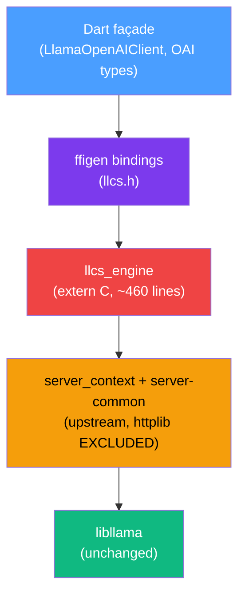
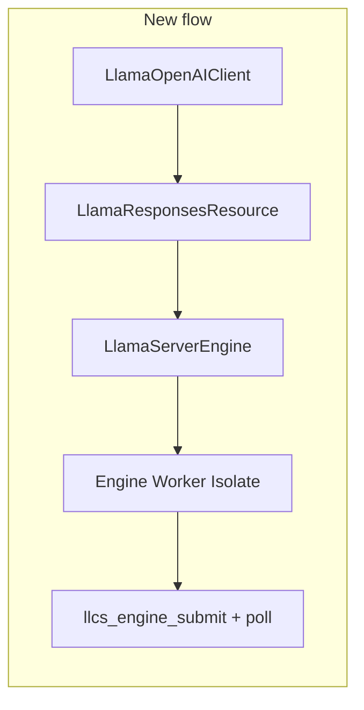

# Implementation Plan: `server_context` Engine Binding (v0.6.0)

> [!IMPORTANT]
> This plan supersedes the [c-shim-tool-calling.md](file:///Users/gao/Workspace/gsmlg-app/lib_llama_cpp/docs/design/c-shim-tool-calling.md) design.
> The design document has been saved to [server-context-engine.md](file:///Users/gao/Workspace/gsmlg-app/lib_llama_cpp/docs/design/server-context-engine.md).

## Architecture Summary

## Phase 1 Result: httplib Stripping — ✅ PASSED

> [!TIP]
> The risk gate is **cleared**. Upstream server code is already modularized into separate files, making httplib stripping trivial — **zero upstream patches needed**.

### Key Findings

The upstream server has been refactored into clean modules:

| File | Role | Our action |
|---|---|---|
| `server-context.cpp/h` | Core engine: model load, slot mgmt, decode loop, routes | **Compile** |
| `server-common.cpp/h` | OAI format parsing, tokenization helpers | **Compile** |
| `server-task.cpp/h` | Task types, result types | **Compile** |
| `server-queue.cpp/h` | Task queue, response queue, response_reader | **Compile** |
| `server-chat.cpp/h` | Responses API / Anthropic conversion | **Compile** |
| `server-http.h` | Lightweight abstraction structs (`server_http_req/res/context`) | **Include header only** |
| `server-http.cpp` | httplib implementation (`#include <cpp-httplib/httplib.h>`) | **Exclude** |
| `server-models.cpp/h` | Router mode, multi-model management | **Exclude** |
| `server-tools.cpp/h` | Built-in tools (file ops, shell) needs `sheredom/subprocess.h` | **Exclude** |
| `server.cpp` | `main()`, signal handlers, HTTP route registration | **Exclude** |
| `server-cors-proxy.h` | CORS proxy for WebUI MCP | **Exclude** |

### Strategy: Stub instead of Patch

Instead of `#ifdef LLAMA_SERVER_NO_HTTP` guards (which would require upstream PR), we:
1. **Exclude** `server-http.cpp` from compilation (no httplib link)
2. **Provide stub** `server_http_context` methods in [llcs_engine.cpp](file:///Users/gao/Workspace/gsmlg-app/lib_llama_cpp/packages/lib_llama_cpp_ffi/src/shim/llcs_engine.cpp) (~10 lines)
3. **Provide stub** `common_remote_get_content` (returns 501 — no HTTP media downloads in embedded mode)
4. Keep `server-http.h` for the type declarations that `server_routes` references
5. `server_routes` compiles but is never instantiated by our code

**Patch line count: 0. Upstream PR: deferred, not blocking.**

## Completed Work

### Phase 2: `llcs_engine` C++ Shim — ✅ Done (Phase 2.1–2.2)
- [x] **2.1** [llcs.h](file:///Users/gao/Workspace/gsmlg-app/lib_llama_cpp/packages/lib_llama_cpp_ffi/src/shim/llcs.h) — 7 entry points: `create`, `destroy`, `caps`, `submit`, `poll`, `cancel`, `string_free`
- [x] **2.2** [llcs_engine.cpp](file:///Users/gao/Workspace/gsmlg-app/lib_llama_cpp/packages/lib_llama_cpp_ffi/src/shim/llcs_engine.cpp) — ~460 lines wrapping `server_context` + stubs

### Phase 3: Build System — ✅ Done (all platforms)
- [x] **3.1** [lib_llama_cpp_macos.podspec](file:///Users/gao/Workspace/gsmlg-app/lib_llama_cpp/packages/lib_llama_cpp_macos/macos/lib_llama_cpp_macos.podspec) — server sources + exclusions + header paths
- [x] **3.2** [lib_llama_cpp_ios.podspec](file:///Users/gao/Workspace/gsmlg-app/lib_llama_cpp/packages/lib_llama_cpp_ios/ios/lib_llama_cpp_ios.podspec) — mirrored macOS changes
- [x] **3.3–3.5** [lib_llama_cpp_cpu_backend.cmake](file:///Users/gao/Workspace/gsmlg-app/lib_llama_cpp/packages/cmake/lib_llama_cpp_cpu_backend.cmake) — `llcs-server` static lib + engine source (Android/Linux/Windows)
- [x] **3.6** macOS debug binary: **28 MB** (framework, single arch, unstripped)

### Phase 4: ffigen Config — ✅ Done
- [x] **4.1** [ffigen.yaml](file:///Users/gao/Workspace/gsmlg-app/lib_llama_cpp/packages/lib_llama_cpp_ffi/ffigen.yaml) updated with `llcs_*` symbol patterns
- [x] **4.2** [lib_llama_cpp_bindings.h](file:///Users/gao/Workspace/gsmlg-app/lib_llama_cpp/packages/lib_llama_cpp_ffi/include/lib_llama_cpp_bindings.h) includes `llcs.h`

### macOS Build Verification — ✅ PASSED

> [!NOTE]
> Clean `flutter build macos --debug` completes successfully. Only warnings are upstream ggml unused function warnings and harmless duplicate `-lc++` flag.

## Remaining Work

### Phase 2 (continued)
- [ ] **2.3** Compile-time canaries: `static_assert` on key method signatures

### Phase 4 (remaining)
- [ ] **4.3** Run `melos run ffigen`, verify generated Dart bindings
- [ ] **4.4** Create `LlcsEngine` Dart wrapper with `Finalizable` lifecycle

### Phase 5: Dart `LlamaServerEngine` Refactor

- [ ] **5.1** Create `LlamaServerEngine` implementing `LlamaEngine` interface
- [ ] **5.2** Create engine worker isolate (poll loop + SendPort)
- [ ] **5.3** Map engine events → existing response types
- [ ] **5.4** Wire cancellation
- [ ] **5.5** Switch `LlamaOpenAIClient` default engine
- [ ] **5.6** Verify old `LibLlamaCpp.transform` still works

### Phase 6: Deprecation Marking
- [ ] Mark obsoleted files (`tool_aware_streaming.dart`, `tool_call_fallback.dart`)

### Phase 7: Testing
- [ ] **7.1** Dart-unit fixtures (mock engine replay)
- [ ] **7.2** Per-family integration (Qwen2.5-0.5B real round-trip)
- [ ] **7.3** Streaming oracle (openai-python parser)
- [ ] **7.4** Existing smoke tests pass
- [ ] **7.5** Runtime smoke parse on init
- [ ] **7.6** Cancellation latency test

### Phase 8: Documentation
- [ ] **8.1** Update README
- [ ] **8.2** Mark old c-shim doc as superseded ✅
- [ ] **8.3** Deprecation notes
- [ ] **8.4** Submodule bump workflow

## Key Decisions Still Needed

1. **`LlamaEngine` naming**: The interface `LlamaEngine` already exists at [lib_llama_cpp.dart:L10](file:///Users/gao/Workspace/gsmlg-app/lib_llama_cpp/packages/lib_llama_cpp/lib/src/lib_llama_cpp.dart#L10). Use `LlamaServerEngine` for the new implementation.
2. **CI model**: Qwen2.5-0.5B-Instruct Q4_0 (~300 MB) — acceptable for CI cache budget?
3. **Poll timeout**: 100ms default — does this meet latency requirements?

## Files Modified

| File | Change |
|---|---|
| `packages/lib_llama_cpp_ffi/src/shim/llcs.h` | **New** — extern "C" ABI header (95 lines) |
| `packages/lib_llama_cpp_ffi/src/shim/llcs_engine.cpp` | **New** — engine implementation + stubs (458 lines) |
| `packages/lib_llama_cpp_ffi/include/lib_llama_cpp_bindings.h` | Added `#include "llcs.h"` |
| `packages/lib_llama_cpp_ffi/ffigen.yaml` | Added `llcs_*` to all filter sections |
| `packages/lib_llama_cpp_macos/macos/lib_llama_cpp_macos.podspec` | Added server sources, exclusions, include paths |
| `packages/lib_llama_cpp_ios/ios/lib_llama_cpp_ios.podspec` | Mirrored macOS server sources |
| `packages/cmake/lib_llama_cpp_cpu_backend.cmake` | Added `llcs-server` static lib + engine source |
| `docs/design/server-context-engine.md` | **New** — full design document |
| `docs/design/c-shim-tool-calling.md` | Marked as superseded |
